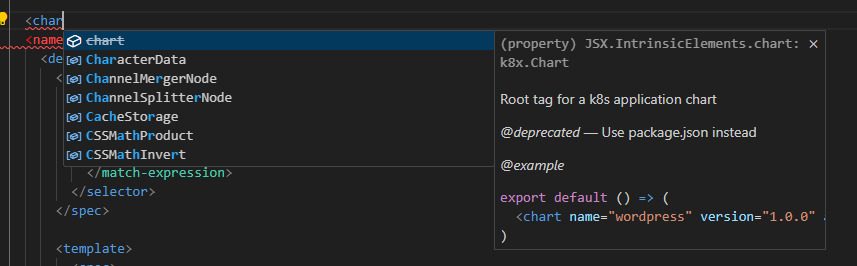

# Kubernetix (K8x)
Deploy and manage reusable apps with typescript and javascript

## Features:

- .env integration
  - K8X_MY_VARIABLE
- Automatic namespace handling
  - Auto create/upgrade namespaces
- Sharing
  - `npm install -D @charts/wordpress`
  - `import Wordpress from "@charts/wordpress"`
- Packaging/Versioning
  - `npm version patch -m "Upgrade to 1.0.1 for reasons"`
  - `npm pack @charts/wordpress`
  - `npm publish wordpress.tgz`
- Typescript
- Single binary
- Safe sandboxing
- Proper IDE support
  
- Single installation definition
  - Specify `chart.name` and run `k8x install` without name parameter
- Interactive chart inspection
  - Load and inspect a file interactively with k8x inspect. It will display all information rendered based on the
  - input it has. 
- Reusable components
  - Props
- Hooks
  - `<Wordpress beforeInstall={slackMessage} afterInstall={slackMessage} onError={handleError} />`
  - `beforeInstall` `afterInstall` `onInstallError` `beforeUpdate` `afterUpdate` `onUpdateError` 

## Usage

```
k8x install <file>
k8x inspect <file>
k8x new <path>
k8x version
```

## Goals
Reuse existing infrastructure and code features for enhanced developer experience

## Non Goals
- Replace helm

## Helm differentiation

I feel like helm was built by the ops side of devops people. k8x is built by the dev side of devops people.

In general k8x is pretty similar to helm. It also took a lot of inspiration from it. But where helm is reinventing the wheel, k8x just falls back to already used mechanisms and infrastructure. (npm/typescript/configuration)

| Topic | helm     | k8x   |
| -------- |----------|-------| 
| Packaging | custom   | npm   |
| Templating | gotmpl   | js/ts |
| Configuration | --set servers.foo.port=80 | .env  |
| Scripting | custom   | js/ts |
| Code sharing | custom   | js/ts |

By custom I mean either a custom implementation, or a existing template language with limited or changed features.

## Terminology

### Component

A piece of reusable/configurable code, that is typically a kubernetes object, for example ingress, pod, service
